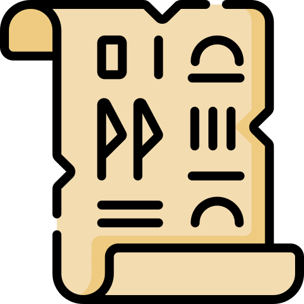

# Papyrus

Note taking cli tools that i use daily to keep track of my work

## TODO

### Go implementation

* [x] port the testing suite
* [x] Implement the time format logic
* [x] Implement the find position methods
* [x] Implement backup logic
* [x] Configure viper/defaults to get journal file and editor from config or env variables
* [ ] Wire the root command to do the auto magic detection logic
* [ ] Install papyrus binary into bin instead of the python one
* [ ] Make script
* [ ] Refactor Cli and possibly find a better approach than static/global variables

### Functional Requirements

* [ ] round time to 5 minute blocks ?
* [ ] add tags automatically to words
  * [ ] extension/rules system
* [ ] write new today sentence (today)
* [ ] generate weekly status
* [ ] time spent breakdown
* [ ] close off the past entry timestamp
* [ ] reminder to add entry to the journal
* [ ] cli runs a server to display stats, and other reports (UI)
* [ ] check if clipboard contains a link, and add additional tags to entry (e.g. pull request link -> #pr)
  * [ ] add an option to make rules injectable so i can include private rules without adding them to the code

### Backwards compatibility

* [ ] Reformat my old journals into new format
* [ ] Import notes from one-note
* [ ] Import notes from quip

### Documentation

* [ ] add documentation, usage, description for the project
  * [ ] something like a blog post to share with others ("this is how i manage my notes")
* [ ] add setup instructions
* [ ] add build/development instructions ( i don't expect external contributions, but could be useful for me updating the code in 6 months)

### Maybe ?

* [ ] auto close entries  based on some rules, or some interactive wizard/ ui + server
* [ ] rotate journal monthly ?
  * [ ] Smarter rotation by completion of goals?

* [ ] setup auto build and test actions on github (... just want to try it)
* [ ] add build badges (.. looks good :D)

### (Bad/Crazy/Maybe?) Ideas

* [ ] Change the structure to be a tree like, entries have sub entries, ...  (sounds like too much generalization for no much value here)
* [ ] in memory files with papyrus handling every section separately to a septate file ? but allows notes to read all sections in the same way (sounds too complicated for what i need, and does not add much value)
